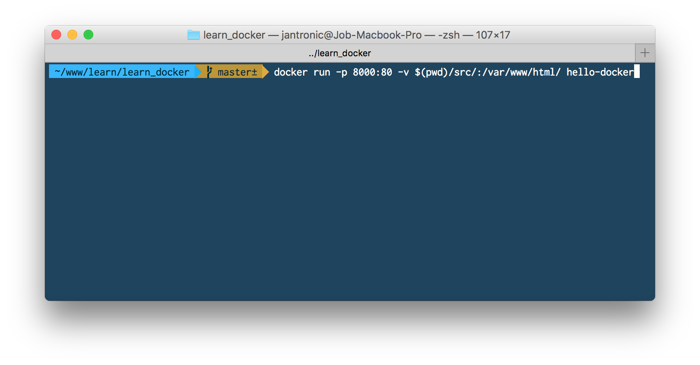

# learn_docker
Try to use docker for better life :D
## First Step!
- We have to create ```Dockerfile``` first!
- We place ```Dockerfile``` in a same directory with out project, you can see from this repository.

  ### Example of Dockerfile
  ```dockerfile
  # FROM <image from repositories>
  FROM php:7.0-apache
  # COPY is command to copy files from local computer to DockerImage
  COPY src/ /var/www/html
  # EXPOSE is command to use port 80 by default
  EXPOSE 80
  ```
  You can find more repositories from [http://hub.docker.com](https://hub.docker.com/) .  
  For my example, I use this one [php](https://hub.docker.com/_/php/)

## Second Step!
  - We have to use command to do something.
  - After we create a Dockerfile, we need to build it by using following command below.

  #### build an image from Dockerfile
  ```sh
  $ docker build -t #<image-name> #<path to DockerFile>  
  # example  
  $ docker build -t hello-docker .
  ```

  - Now, an image has been created.
  - We can run it by using run command.

## Third Step!
  - Use `run` to run an image.

  #### run an image
  ```sh
  $ docker run -p #<local port:docker port> #<image name>  
  # example  
  $ docker run -p 8080:80 hello-docker
  ```
  - Now, image is running, and you can try to open it on your browser. [http://localhost:8080](http://localhost:8080)

## Futher more!!!!
  - **If you try to change any file in local, it would not change in docker too.**
  - So, docker has a feature to share volume between docker and local as the same volume.
  - We will specify path for docker to share volume by use ```-v``` parameter.

  ```sh
  $ docker $ docker run -p 8080:80 -v /Users/jirachai/www/learn/learn_docker/src:/var/www/html/ hello-docker
  ```
  ##### Explain code
  ```
  -v <Your path to share from local>:<Path on docker to place>
  ```

  

***END :D***
